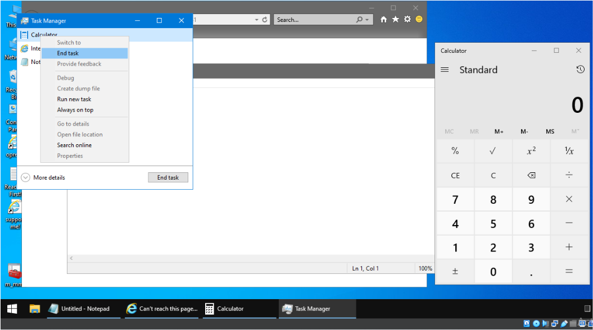
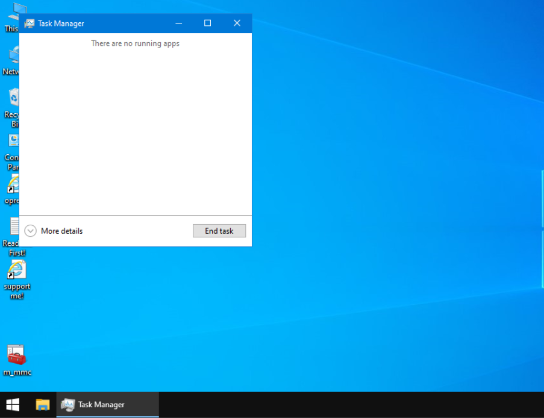
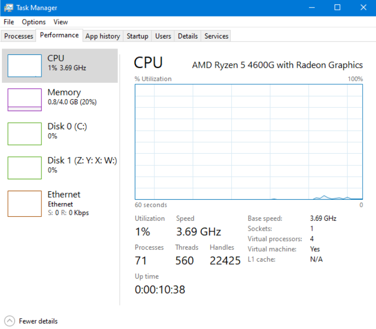
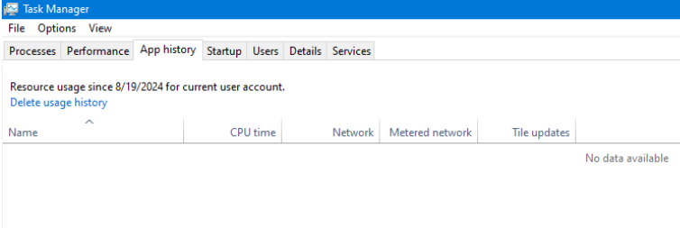
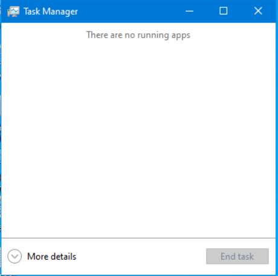

# Tarea: Procesos - Administrador de tareas

En esta práctica veremos ejercicios sobre los contenidos que hemos visto en teoría.

## Ejercicio 1

Poner en marcha el Bloc de Notas de Windows, el navegador Edge y la calculadora.

Lanza el Administrador de Tareas desde el botón de inicio y detén las tres aplicaciones desde el Administrador de Tareas.

Adjunta una captura de pantalla de cada una de las aplicaciones *Terminadas*.

### A punto de terminar los procesos.

### Procesos terminados.

## Ejercicio 2

Utilizando la ventana de Rendimiento del Administrador de Tareas, obtén el tiempo que lleva encendido el Sistema.

Adjunta captura de pantalla

### El equipo lleva diez minutos encendido.

## Ejercicio 3

Elabora una lista con las 3 aplicaciones más utilizadas por el usuario *adminiso*.

### No hay historial de aplicaciones por el uso casi nulo de la máquina.

## Ejercicio 4

Necesitamos obtener el nombre y la descripción de una serie de programas que podemos encontrar en el sistema. Mediante la ventana *Detalles*, obtén los siguientes datos (rellena la tabla):

| Aplicación              | Nombre del ejecutable | Descripción |
| ----------------------- | --------------------- | ----------- |
| Bloc de notas           | notepad.exe           | Notepad                   |
| Edge (Internet explorer)| iexplore.exe          | Internet Explorer         |
| Explorador de ficheros  | explorer.exe          | Windows Explorer          |
| Paint                   | mspaint.exe           | Paint                     |
| Calculadore             | Calculator.exe        | Calculator.exe            |
| cmd                     | cmd.exe               | Windows Command Processor |
| Configuración           | SystemSettings.exe    | Settings                   |

## Ejercicio 5

Comprueba en tu ordenador de casa cuantas aplicaciones se arrancan en el inicio de la Sesión.

Realiza una captura de pantalla.

### Luego de encender el ordenador, no inicia ninguna aplicación.

