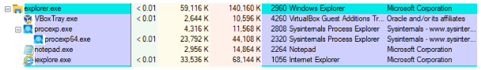
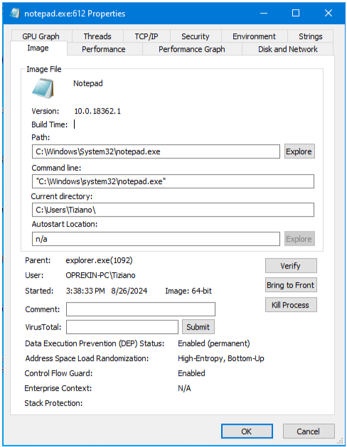

# Tarea: Procesos - Process Explorer

Para la realización de las siguientes prácticas deberemos instalar en el Sistema la herramienta Process Explorer:

[Process Explorer](https://docs.microsoft.com/en-us/sysinternals/downloads/process-explorer#download)

Se trata de un software desarrollado por SysInternals y que fué comprado por Microsoft y ahora se ofrece de manera gratuita desde la página de Microsoft.

## Ejercicio 1

Lanza el Bloc de Notas y el Edge, abre el Process Explorer y comprueba que los procesos han sido lanzados y están en marcha.

Realiza una captura de pantalla.

\ 

## Ejercicio 2

Utilizando la opción de menú *Propiedades* sobre notepad.exe, obtén los siguientes datos acerca del ejecutable del Bloc de Notas.

\

* **Path:** C:\Windows\System32\notepad.exe
* **Linea de ejecución:** C:\Windows\system32\notepad.exe
* **Directorio actual:** C:\Users\Tiziano\
* **Usuario que lo ha lanzado:** OPREKIN-PC\Tiziano
* **Proceso que lo ha lanzado (padre):** explorer.exe(1092)
* **Versión:** 10.0.18362.1

## Ejercicio 3

Obtén los mismos datos de 4 programas conocidos. Puedes realizar esta tarea en casa.

### Internet Explorer

* **Path:** C:\Program Files\Internet Explorer\iexplore.exe
* **Línea de ejecución:** C:\Program Files\Internet Explorer\iexplore.exe
* **Directorio actual:** C:\Users\Tiziano\Desktop\
* **Usuario que lo ha lanzado:** OPREKIN-PC\Tiziano
* **Proceso que lo ha lanzado (padre):** explorer.exe(1092)
* **Versión:** 11.0.18362.1

### VirtualBox

* **Path:** C:\Program Files\Oracle\VirtualBox\VBoxSVC.exe
* **Línea de ejecución:** C:\Program Files\Oracle\VirtualBox\VBoxSVC.exe -Embedding
* **Directorio actual:** C:\Users\Usuario\
* **Usuario que lo ha lanzado:** DESKTOP-83T9SPF\Usuario
* **Proceso que lo ha lanzado (padre):** svchost.exe(764)
* **Versión:** 7.0.16.12802

### Google Chrome

* **Path:** C:\Program Files\Google\Chrome\Application\chrome.exe
* **Línea de ejecución:** C:\Program Files\Google\Chrome\Application\chrome.exe
* **Directorio actual:** C:\Program Files\Google\Chrome\Application\127.0.6533.120\
* **Usuario que lo ha lanzado:** DESKTOP-83T9SPF\Usuario
* **Proceso que lo ha lanzado (padre):** explorer.exe(19324)
* **Versión:** 127.0.6533.120

### Steam

* **Path:** C:\Program Files (x86)\Steam\steam.exe
* **Línea de ejecución:** C:\Program Files (x86)\Steam\steam.exe -silent
* **Directorio actual:** C:\Program Files (x86)\Steam\
* **Usuario que lo ha lanzado:** DESKTOP-83T9SPF\Usuario
* **Proceso que lo ha lanzado (padre):** explorer.exe(19324)
* **Versión:** 9.13.58.96
